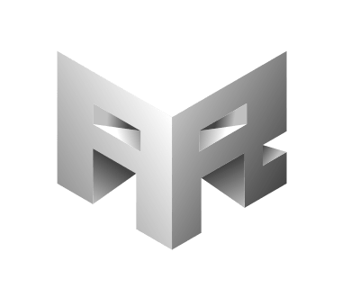

<h1 align="center">alexrapley.com</h1>

<h1 align="center">

  
  
</h1>

<b>Personal portfolio project for Coder Factory Academy Term 1. 
Built using HTML, CSS, jQuery and Ruby on Rails
</b>

---

## The Process :triangular_ruler:

My goal for this project was to create a clean, minimal and modern portfolio page. I took my previous portfolio design and replaced images with colour gradients, straight lines with skewed lines and a number of other alterations to create a modern and engaging experience for the user.

<b>Previous:</b>
 

 
<b>Current:</b>
 

Most of my design choices were made after compiling a small check list on paper...

I also used [Trello](https://trello.com/b/lujtBX49/personal-portfolio) to make sure I kept to my original plan and was fulfilling the outcomes I had set for the project...

Due to my design being image heavy, I decided to use [Optimizilla](http://optimizilla.com/) to create optimised, minified copies of my images which drastically decreased load time.

## The Design :pencil2:

My favourite example of engaging, clean web design at the moment is https://stripe.com, so naturally when given the task of revamping my own website, I took a lot of inspiration from [Benjamin de Cock's](https://dribbble.com/bdc) designs.

Two of my biggest shifts in design were using an animated colour gradient for backgrounds and condensing my introduction blurb translations into one flippable card. I used [David Walsh's CSS Flip](https://davidwalsh.name/css-flip) guide and [Ian Forrest's Gradient Animator](https://www.gradient-animator.com/) to bring these ideas to fruition.

I also implemented a new contact form which provides the user a quick and simple way to get in touch. The form is built on Rails and [Mailgun](https://www.mailgun.com/).

[Start Bootstrap's Freelancer Theme](https://blackrockdigital.github.io/startbootstrap-freelancer/) was also crucial in determining my initial layout.

## The Projects :art:

The bulk of my projects section is made up of web application challenges completed as part of [FreeCodeCamp's](https://freecodecamp.com) Front End Development certificate as well as [Rob Dey's Essential Web Developer Course](http://upskillcourses.com/courses/enrolled/essential-web-developer-course).

I've started to get very interested in Virtual Reality, more specifically WebVR and decided that I'd like to try and create a WebVR experience as part of my portfolio. I made some decent strides but the project is still definitely unfinished and in its early stages. The project is accessable by clicking the VR HMU icon in the bottom left of the screen.

I used the [A-Frame Framework](https://aframe.io) in conjunction with [A-Frame Extras by Don McCurdy](https://github.com/donmccurdy/aframe-extras). I also got a lot of inspiration from [Eddie Barkman's VR Design Portfolio](http://eddiebarkman.com/VR-Design-Portfolio/).

 

<h3>Thanks for reading and enjoy the portfolio! :shipit:</h3>

